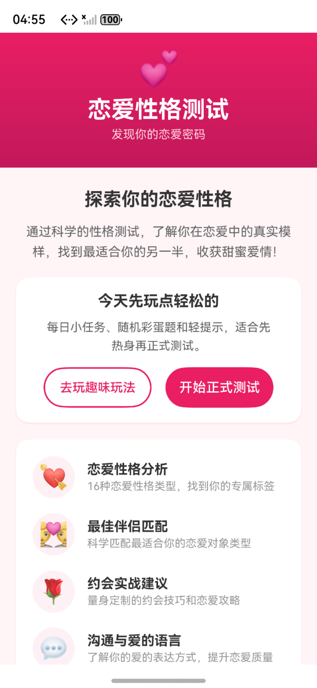
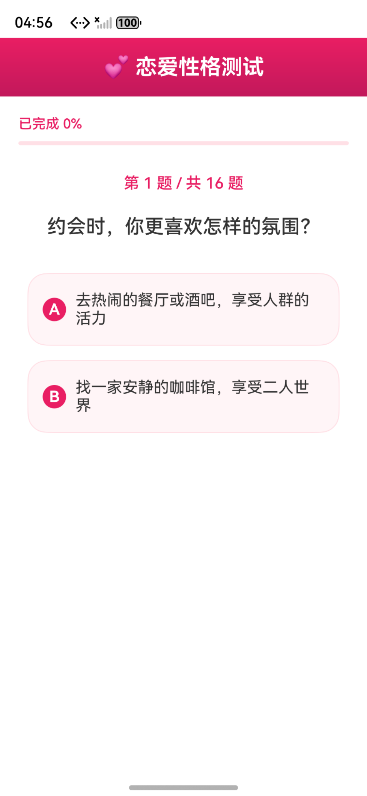
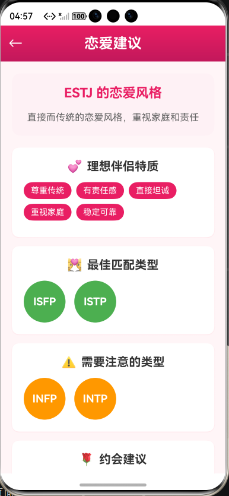
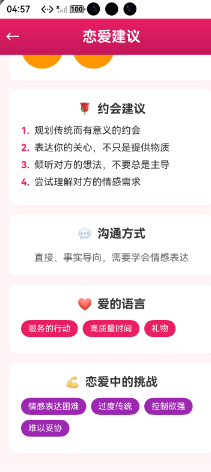
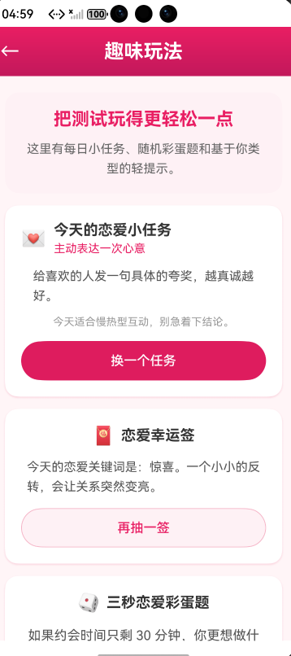
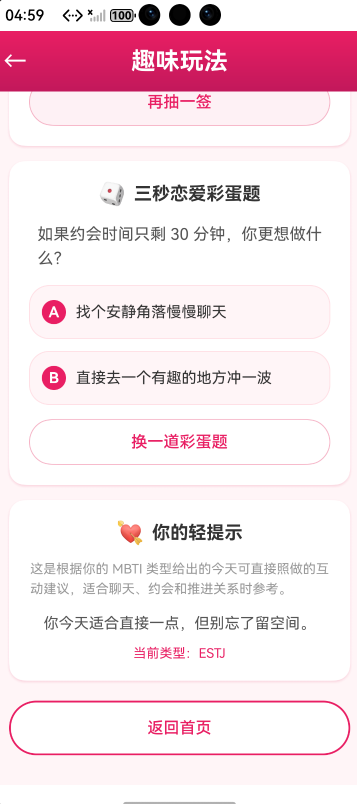

# 💕 恋爱性格测试

一款基于 HarmonyOS ArkTS 开发的恋爱性格测试应用。应用围绕 MBTI 性格测试、恋爱建议和趣味互动展开，帮助用户了解自己在恋爱中的真实模样，找到更适合的相处方式。

## ✨ 项目亮点

- 16 道恋爱场景题，贴近日常约会与互动情境
- 基于 MBTI 四维度分析，输出更具体的恋爱性格画像
- 结果页展示性格标签、最佳匹配与约会建议
- 趣味玩法页提供每日小任务、幸运签和彩蛋题，提升留存和分享感
- 整体视觉采用粉色系浪漫风格，适合轻量、治愈、偏情感类产品

## 📸 页面展示

> 下面 6 张图已按你提供的顺序放到项目的 `docs/images/` 目录下，可以直接在 README 中渲染。

### 1. 首页



首页用于快速建立产品感知，突出应用主题、核心能力和主要入口，用户可以直接进入正式测试或先体验趣味玩法。

### 2. 测试题目展示



测试页展示 16 道恋爱场景题，配合进度提示和选项卡片，让用户在轻松的浏览节奏中完成测评。

### 3. 测试结果展示 - 上半部分



这张图展示了结果页上半部分，包括性格建议、理想匹配类型和需要注意的类型，适合快速建立结果页的核心印象。

### 4. 测试结果展示 - 下半部分



这张图展示了结果页下半部分，包含约会建议、沟通方式、爱的语言和恋爱中的挑战，补全完整的结果阅读体验。

### 5. 趣味玩法展示 - 上半部分



趣味玩法页上半部分展示每日小任务、幸运签和三秒恋爱彩蛋题，适合作为正式测试前后的轻量入口。

### 6. 趣味玩法展示 - 下半部分



下半部分展示今日提示和返回首页入口，帮助用户继续留在应用内探索更多恋爱互动内容。

## 🔍 功能模块

### 恋爱性格测试
- 16 道精心设计的恋爱场景题目
- 基于 MBTI 四维度 E-I、S-N、T-F、J-P 进行分析
- 测试进度实时显示，支持继续作答和返回修改

### 恋爱性格分析
- 16 种恋爱性格类型详细解读
- 恋爱中的优势与提醒并存，帮助用户更好认识自己
- 提供更贴近约会和关系推进的说明

### 最佳伴侣匹配
- 科学匹配适合你的恋爱对象类型
- 给出需要注意的磨合类型
- 展示理想伴侣的特质标签

### 约会实战建议
- 针对不同类型给出约会建议
- 提供沟通方式、爱的语言和关系推进建议
- 帮助用户把“知道自己”转化为“更好相处”

### 趣味互动玩法
- 每日恋爱小任务
- 随机幸运签和轻提示
- 三秒恋爱彩蛋题
- 基于 MBTI 的轻量化互动内容

## 📱 页面说明

| 页面 | 说明 |
|------|------|
| Index | 首页，展示应用主题、功能入口和核心亮点 |
| TestPage | 测试页面，完成 16 道恋爱场景题 |
| ResultPage | 结果页面，展示性格分析、匹配建议和沟通建议 |
| LoveAdvicePage | 恋爱建议页面，提供更完整的约会和关系指导 |
| FunPage | 趣味玩法页面，提供小任务、彩蛋题和今日提示 |

## 🚀 使用流程

1. 打开应用，进入首页
2. 可先进入趣味玩法，做每日任务或抽幸运签热身
3. 点击开始测试，进入 16 道恋爱场景题
4. 完成测试后查看性格结果、最佳匹配和建议
5. 继续浏览恋爱建议页面，或返回趣味玩法继续体验

## 🗂️ 项目结构

```
entry/src/main/ets/
├── model/
│   └── MBTIModel.ets          # 数据模型定义
├── data/
│   ├── MBTIQuestions.ets      # 恋爱测试题目数据
│   ├── MBTIResults.ets        # 16 种性格类型结果数据
│   └── LoveAdviceData.ets     # 16 种类型恋爱建议数据
└── pages/
    ├── Index.ets              # 首页
    ├── TestPage.ets           # 测试页面
    ├── ResultPage.ets         # 结果展示页面
    ├── FunPage.ets            # 趣味玩法页面
    └── LoveAdvicePage.ets     # 恋爱建议页面
```

## 🛠️ 开发环境

- **框架**: HarmonyOS ArkTS
- **SDK版本**: 6.0.2(22)
- **目标设备**: Phone
- **运行系统**: HarmonyOS

## 📋 运行说明

1. 使用 DevEco Studio 打开项目
2. 在 Tools > Device Manager 中创建并启动手机模拟器
3. 点击运行按钮，选择目标模拟器
4. 应用启动后自动进入首页

## 🎨 设计风格

- **主色调**: 粉色系 (#E91E63)
- **渐变色**: #E91E63 → #C2185B
- **背景色**: #FFF5F7
- **卡片阴影**: #FFE0E6
- **整体风格**: 浪漫、温馨、简洁
