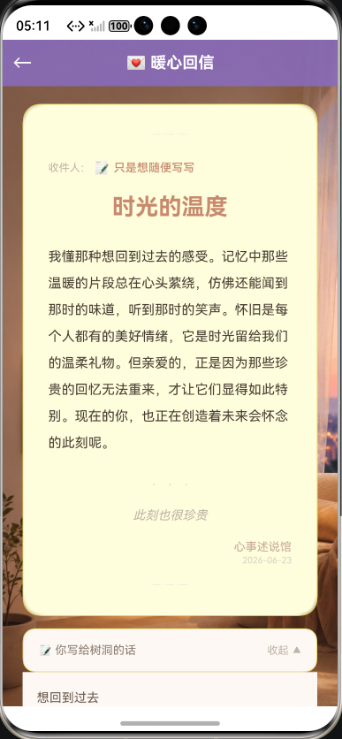
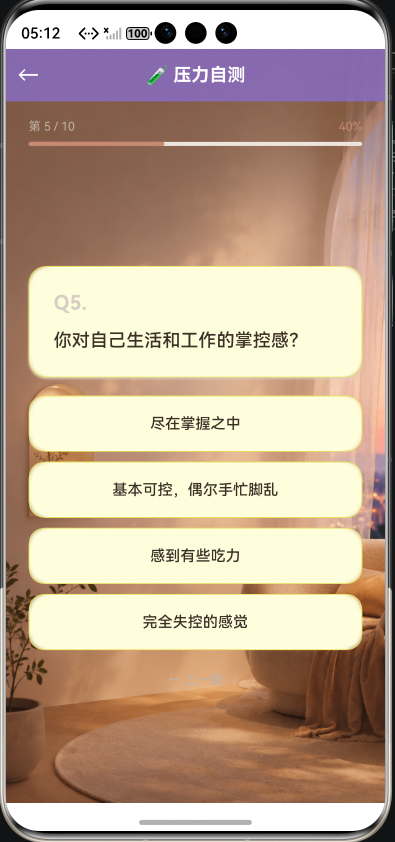
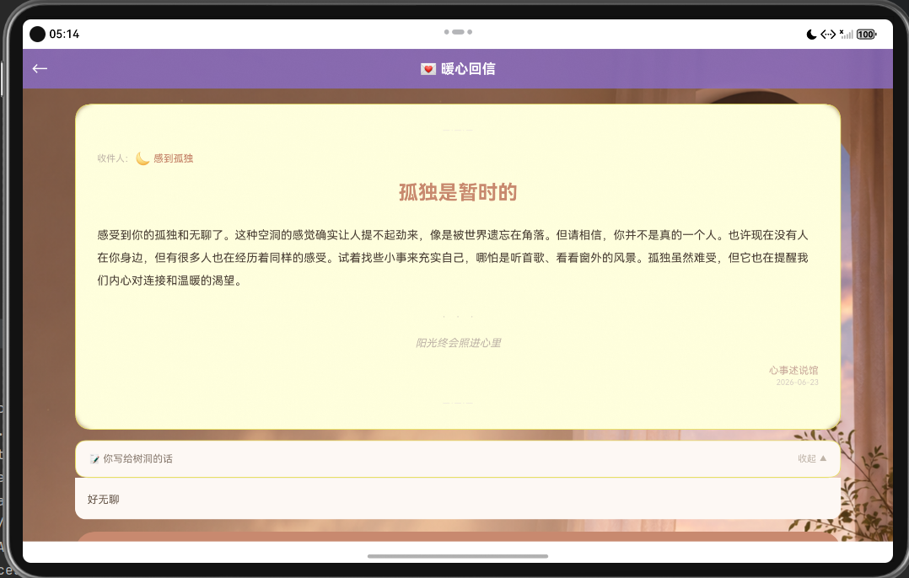

# 🕯️ 心事述说馆

一款基于 HarmonyOS ArkTS 开发的温暖治愈类元服务。用户可以写下心事、获得 AI 实时生成的专属回信、进行心理压力测评、以及享受每日治愈内容。项目同时实现了**一次开发多端部署**（Phone + Tablet 自适应）和**跨设备自由流转**（分布式迁移）两大鸿蒙核心特性。

## ✨ 项目亮点

- **AI 智能回信** — 写完心事即可获得 AI 实时生成的专属温暖回信，基于硅基流动 DeepSeek-V3 模型，AI 不可用时自动回退到 16 条精心编写的本地预设回信
- **8 种心事类别** — 焦虑、开心、不敢说、孤独、疲惫、迷茫、失恋、随便写，每种配有走心的引导书写提示
- **心理压力测评** — 10 道专业评估题覆盖睡眠、情绪、社交、精力等维度，输出 4 个压力等级 + 定制化建议
- **每日治愈角** — 每日一言（7 条心灵语录）、每日小任务（6 个暖心动议）、心情签（8 支治愈签文），基于日期自动推荐
- **本地关系型数据库** — 使用 `@kit.ArkData` 持久化用户心事记录、阅读历史和任务完成状态
- **一次开发多端部署** — Phone + Tablet 双端自适应，基于 600vp 断点的 ResponsiveLayout 系统
- **跨设备自由流转** — 支持手机 ↔ 平板无缝迁移，书写进度/回信内容/测试状态全程同步
- **暖纸质触感设计** — 陶土棕配色 + 半透明卡片 + 手写信笺排版，温暖治愈不刺眼

## 📸 页面展示

### 1. 首页


首页顶部展示根据时段变化的动态问候语（"早安 ☀️" / "晚上好 🕯️"）、应用名称和 slogan。主体区域以三张半透明毛玻璃卡片作为功能入口——写下心事、压力小测试、今日治愈，每张卡片配有 emoji 图标和功能简述。页面底部附有自由流转调试面板。

### 2. 回信页



用户写完心事提交后，跳转到回信页展示温暖回信。回信采用手写信笺风格：顶部 `—·—·—` 折痕装饰、收件人信息标签、暖色标题、宽行距正文（30px）、装饰分隔符 `·   ·   ·`、斜体结尾语，以及右对齐落款"心事述说馆"和当日日期。下方可展开回顾用户自己写下的心事原文。底部提供快捷入口——去压力测试、去治愈角、再写一封、返回首页。

### 3. 压力自测



压力测试页以轻柔问答形式呈现 10 道评估题。顶部显示进度百分比和圆角进度条，每题以"Q1."格式编号、卡片式白色问题框、四个选项按钮垂直排列。完成全部题目后跳转结果页——彩色背景头部显示压力等级（低压区 / 轻度 / 中度 / 高压区）、emoji 图标、得分区间，下方依次展示结果描述、信号清单（你可能正在经历的）、定制化建议、免责声明，底部可重新测试或返回首页。

### 4. 今日治愈


治愈角包含三个模块：顶部"每日一言"以日签式卡片展示——日期胶囊标签、emoji、20px 加粗引文、出处水印、"换一句"按钮；中部"今日小任务"以便签卡片展示——任务 emoji + 标题 + 鼓励语、内容区域（暖色/浅绿底）、完成按钮（Sage 绿 ✓ 已标记）+ 换一个按钮；底部"心情签"以暖色渐变签筒呈现——关键字大字间距排版、签文描述、半透明"再抽一签"按钮。

### 5. 多端部署



项目基于 HarmonyOS ResponsiveLayout 系统实现 phone ↔ tablet 自适应。Phone 端保持单列滚动布局，适合单手操作；Tablet 端使用更宽的内容容器（最大 960vp，占屏幕 72%），卡片间距和字体由 600vp 断点统一控制。同时支持**跨设备自由流转**——在手机上书写的进度和内容可以无缝迁移到平板继续完成。

## 📱 功能模块

| 页面 | 路由 | 功能描述 |
|------|------|---------|
| **Index** | `pages/Index` | 首页，时段问候 + 三张半透明毛玻璃入口卡片 |
| **TestPage** | `pages/TestPage` | 书写页，情绪胶囊列表 → 信纸风格书写区 → AI 实时生成回信 |
| **ResultPage** | `pages/ResultPage` | 回信页，手写信笺排版 + 折痕装饰 + 可展开的心事回顾 |
| **LoveAdvicePage** | `pages/LoveAdvicePage` | 压力自测页，10 道评估题 → 四档压力等级 + 信号清单 + 定制建议 |
| **FunPage** | `pages/FunPage` | 治愈角，日签式每日一言 + 便签式小任务 + 暖色渐变心情签 |

## 🚀 使用流程

1. 打开应用，进入首页，根据时段看到动态问候语
2. 点击「写下心事」→ 从 8 种情绪胶囊中选择你当下的心情
3. 在信纸风格的书写区写下你想说的话 → 点击「💌 把心事交出去」
4. AI 实时生成专属温暖回信，以手写信笺格式展示
5. 展开回顾区查看自己写下的心事原文
6. 点击「测测你的压力水平」→ 完成 10 道评估题 → 获取压力报告和定制建议
7. 进入「今日治愈」→ 读一句温暖的话、完成一个治愈小任务、抽一支心情签

## 🗂️ 项目结构

```
entry/src/main/ets/
├── common/
│   ├── ResponsiveLayout.ets     # 多端适配断点系统（600vp 阈值，Compact / Expanded）
│   └── FreeFlowState.ets        # 跨端迁移自由流转状态管理器（单例）
├── entryability/
│   └── EntryAbility.ets         # 主 UIAbility（跨端迁移 onContinue + 数据库初始化）
├── entrybackupability/
│   └── EntryBackupAbility.ets   # 备份扩展能力
├── model/
│   └── HeartTalkModel.ets       # 数据模型：FeelingCard、StressQuestion、HealingItem 等
├── data/
│   ├── FeelingCards.ets         # 8 种心事类别 + 16 条预设回信（AI 回退方案）
│   ├── AiService.ets            # AI 服务（硅基流动 DeepSeek-V3，OpenAI 兼容格式）
│   ├── StressTestData.ets       # 10 道压力测评题 + 4 档结果建议
│   ├── HealingContent.ets       # 7 条每日一言 + 6 个每日任务 + 8 支心情签
│   └── DatabaseHelper.ets       # 本地关系型数据库（confessions / reading_history / task_completions）
└── pages/
    ├── Index.ets                # 首页
    ├── TestPage.ets             # 书写页（含 AI 生成 + 预设回退）
    ├── ResultPage.ets           # 回信页
    ├── LoveAdvicePage.ets       # 压力自测页
    └── FunPage.ets              # 治愈角
```

## 🤖 AI 回信配置

使用**硅基流动**（SiliconFlow）调用 DeepSeek-V3 模型——国内直连、注册即送 2000 万 token 免费额度、兼容 OpenAI API 格式。

配置方法：

1. 注册 [cloud.siliconflow.cn](https://cloud.siliconflow.cn) 获取 API Key
2. 打开 `entry/src/main/ets/data/AiService.ets`
3. 将 `AI_API_KEY` 替换为你的 Key
4. 如需更换模型，修改 `AI_MODEL`（支持 DeepSeek-V3 / Qwen / GLM 等）

未配置 API Key 或网络调用失败时，自动回退到 `FeelingCards.ets` 中的 16 条本地预设回信，保证用户无感降级。

## 🛠️ 开发环境

- **框架**: HarmonyOS ArkTS
- **SDK 版本**: 6.0.2(22)
- **目标设备**: Phone / Tablet
- **运行系统**: HarmonyOS
- **网络权限**: `ohos.permission.INTERNET`（AI API 调用）

## 📋 运行说明

1. 使用 DevEco Studio 打开项目
2. 在 Tools > Device Manager 中创建并启动手机或平板模拟器
3. 点击运行按钮，选择目标模拟器
4. 应用启动后自动进入首页

> ⚠️ **注意**：DevEco Studio 预览器不支持中文输入法。中文输入请在模拟器或真机上测试。

## 🔄 多端部署与自由流转

### 一次开发多端部署

- **断点系统**：`ResponsiveLayout.ets` 以 600vp 为阈值，自动检测屏幕宽度区分 Compact（手机）和 Expanded（平板）
- **自适应策略**：Phone 端内容宽度 ≥ 320vp，Tablet 端最大 960vp（占屏宽 72%）
- **缩放维度**：字体大小、按钮高度、卡片间距、padding 统一通过响应式布局变量控制
- **module.json5** 声明 `"deviceTypes": ["phone", "tablet"]`，一次编译双端运行

### 跨设备自由流转

- **状态管理**：`FreeFlowStateManager` 单例全局跟踪当前页面和状态参数
- **迁移触发**：`EntryAbility.onContinue()` 将状态序列化写入 Want 参数
- **目标恢复**：目标设备 `EntryAbility.onCreate()` 检测 Want 中是否有流转数据，自动加载对应页面并回填状态
- **支持的流转场景**：书写中（情绪类别 + 已写内容）、回信页（回信内容）、压力测试中（当前题目 + 已选答案）、治愈角（所有索引）
- **调试面板**：首页提供流转模拟工具，可手动注入状态参数测试跨端迁移

## 🎨 设计体系

采用 **暖纸质触感风格（Soft-Surface Paper）**，配色参考 InnerHue 心理安全体系与 Serene 情绪可视化设计。

页面背景图 `bg_warm.png` 由 **GPT Image 2** 生成。开发过程中曾尝试直接用 AI 生成完整的 UI 界面代码，但效果不理想——生成的界面缺乏细节层次、排版生硬、无法精准适配 HarmonyOS ArkTS 组件的行为与约束。最终采用折中方案：**AI 生成背景图片提供氛围感，代码手工精细控制每个组件的布局、行距、阴影和交互逻辑**——两者互补，既省去了手绘素材的成本，又保证了界面质量。

| Token | 色值 | 用途 |
|-------|------|------|
| 页面背景 | `#F9F6F2` | 暖纸色基础背景 |
| 卡片底色 | `#FFFFFFDD` | 半透明白色纸卡（毛玻璃透底图） |
| 暖色底纹 | `#FDF8F4` | 收件标签、回顾区 |
| 主色 Terracotta | `#C8896E` | 主按钮、标题强调、签筒渐变 |
| 主色浅底 | `#F5EBE4` | 图标容器 |
| 渐变 Top | `#D4A373` | 头部渐变暖金端 |
| 文字主色 | `#3D3028` | 正文（暖深棕） |
| 文字次要 | `#8B7D72` | 副标题 |
| 文字弱化 | `#BFB4A8` | 说明、提示、占位 |
| 边框 | `#EDE6DE` | 卡片边界 |
| 阴影 | `#D8CFC4` | 卡片投影 |
| Sage 绿 | `#9BAF8A` | 任务完成标识 |

核心设计原则：

- **纸质触感** — 所有卡片模拟纸卡质感，白底 + 暖灰细边框 + 弱阴影
- **大头圆角** — 卡片 18-22px、按钮 21-27px，消除冰冷直角
- **长信笺排版** — 回信页用折痕装饰、手写体落款、宽行距正文（30px）
- **情绪胶囊** — 心情选择用列表式胶囊替代网格，更安静不吵闹
- **温柔微交互** — 设计上避免强刺激，留白充足，行距 24-34px
- **图片背景** — 暖色液态渐变背景图 `bg_warm.png`，卡片半透明毛玻璃透底

## 🗄️ 本地数据库

应用使用 HarmonyOS 关系型数据库（`@kit.ArkData`），DatabaseHelper 单例管理，包含三张表：

| 表名 | 字段 | 用途 |
|------|------|------|
| **confessions** | id, date, categoryId, categoryName, content, responseTitle, responseBody | 用户心事记录（类别、原文、AI 回信） |
| **reading_history** | id, storyId, readDate | 故事阅读历史 |
| **task_completions** | id, date, taskId, isCompleted | 每日任务完成状态（按 date+taskId upsert） |

数据库在 `EntryAbility.onCreate()` 中初始化，所有页面通过 `DatabaseHelper.instance` 单例访问。
